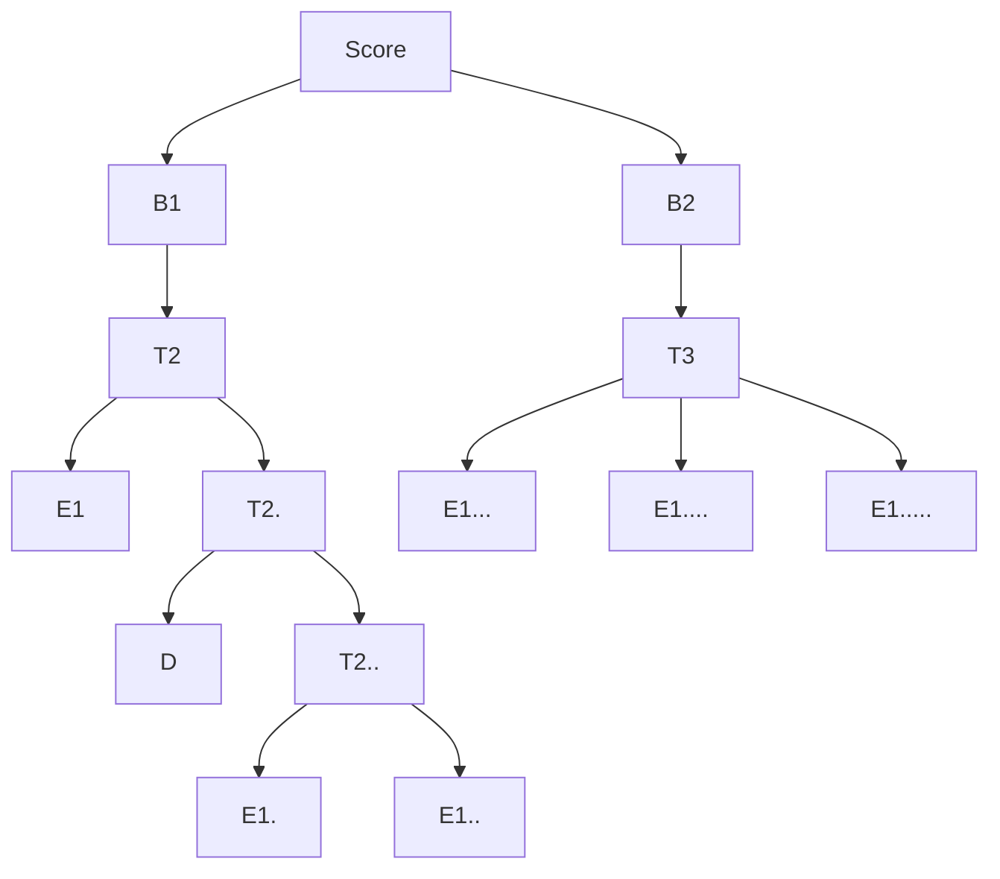
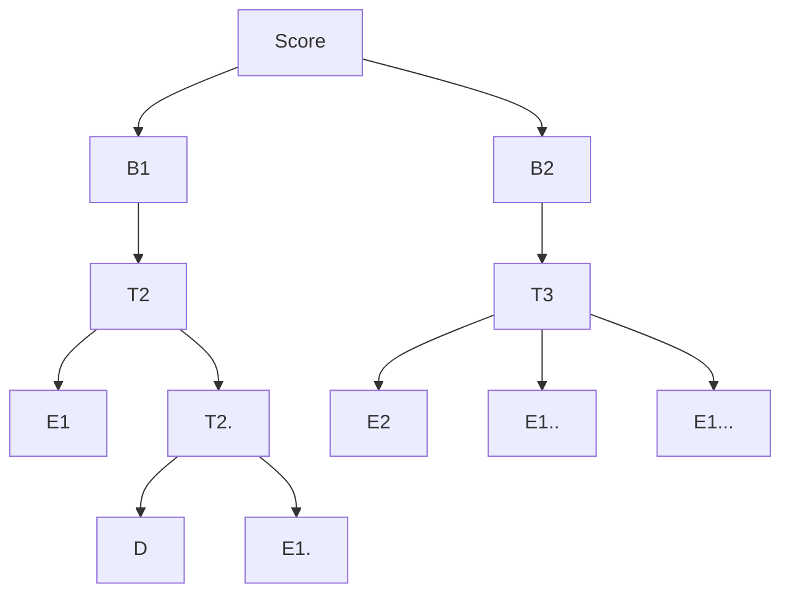
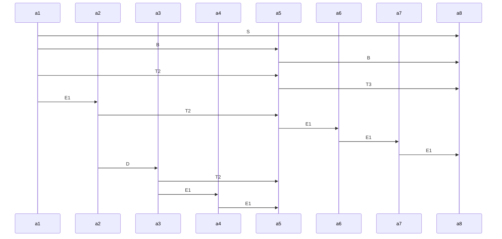

# Rhythm Nested Words

- Alur & Madhusudan's [nested words](https://www.cis.upenn.edu/~alur/nw.html) (NW) can be used instead of trees to represent rhythm notation
- and hence weighted NW-automata (or weighted-VPDA) instead of WTA (with attributes)

advantage: attribute propagation is simpler with W-VPDA:
push attributes values to the stack

see also [Nested Words](:/NestedWords.md)

---

example MCM'19 1
see [example MCM'19](:/6d3f9d44c06c4b0eaee6ea0140a5ffa6)


MTU timestamps: 0 3/4 7/8 | 1 4/3 5/3

**rhythm tree**



**nested-word** 
with explicit symbols for begin and end of match

representation of leaves with 2 symbols (too much nesting)
(not exactly original def. of Alur Madhusudan, similar to VPDA)

```
●...........................S...........................●
|                                                       |
●...............B1...............●-●.........B2.........●
|                                | |                    |
●...............T2...............● ●.........T3.........●
|                                | |                    |
●------E1------●........T2.......● ●--E1--●--E1--●--E1--●
               |                 |
               ●---D---●...T2....●
                       |         |  
                       ●-E1-●-E1-●
```

**nested-word** with leaves as internals. the word becomes

`[S  [B1  [T2  E1  [T2  D  [T2  E1  E1  T2]  T2]  B1]  [B2  [T3  E1  E1  E1  T3]  B2]  S]`

nested presentation:

- the edges `--` and `|` are `next-symbol` relationship in word
- the edges `..` are matching relationship  

```
[S..............................................................S]
 |                                                              |
[B1................................B1]--[B2....................B2]
 |                                  |    |                      |
[T2................................T2]  [T3....................T3]
 |                                  |    |                      |
 E1-------------[T2................T2]   E1---------E1---------E1
                 |                  |
                 D------[T2........T2]
                         |          |  
                         E1--------E1
```

ALT: dropping the requirement that match do not share positions (see Blass, Gurevitch 2006), 

```
|..............s.............|
|....t2,b1....|
     |...t2...|
         |.t2.|    |..t3,b2..|
e1   d   e1   e1   e1   e1   e1
1        2    3    4    5    6   (note number in notation)
```

---

example MCM'19 2


MTU timestamps: 0 3/4 | 1 1 4/3 5/3

**tree**



**nested-word** with too much nesting

```
●.........................S........................●
|                                                  |
●.............B1............●-●.........B2.........●
|                           | |                    |
●.............T2............● ●.........T3.........●
|                           |                    |
●------E1------●......T2....● ●--E2--●--E1--●--E1--●
               |            |
               ●--D--●--E1--●
```

**nested-word** with leaves internal

`[S  [B1  [T2  E1  [T2  D  E1  T2]  T2]  B1]  [B2  [T3  E2  E1  E1  T3]  B2]  S]`

nested presentation: 

```
[S......................................................S]
 |                                                      |
[B1........................B1]--[B2....................B2]
 |                          |    |                      |
[T2........................T2]  [T3....................T3]
 |                          |    |                      |
 E1-------------[T2........T2]   E2---------E1---------E1
                 |          |
                 D---------E1
```

**ALT**

```
|............s............|
|..t2,b1..|     |..t3,b2..|
     |.t2.| 
e1   d    e1    e2   e1   e1
1         2    3,4   5    6
```

---

DRAFT: first **nested-word** (sequence chart version)

